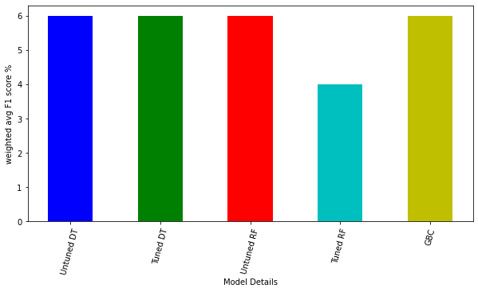
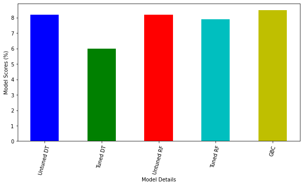

<h2> Introduction </h2>
The prevailing image of a migrant is that of a low-skilled refugee, but very little attention is paid to footballers who play for countries other than those of their birth.  I therefore intend to evaluate the hypothesis that having foreign-born players on a team leads to better FIFA rankings in men’s football. I hope to provide more clarity on the boon to a host nation of having more open migration policies, with an emphasis on the social cohesion and cultural benefit of having successful men’s national football teams.

<h2> Data Sources </h2>
<li> List of FIFA world rankings of men’s national football teams from 1992 to 2019.
.csv file obtained from Kaggle: 9 columns, about 60,000 rows.</li>
<li> List of foreign born players playing for men’s national football teams in the FIFA World Cup from 1930 until 2018.
.xlsx file obtained from Google Datasets: 12 columns, about 10,000 rows.</li>

<h2> Repository Navigation </h2>
<ol>
  <li><a href='https://github.com/1njiku/SB-Capstone1/blob/master/Capstone%231PP-Foreign%20Footballers.pdf'>Project Proposal</a></li>
  <li><a href='https://github.com/1njiku/SB-Capstone1/blob/master/Notebook%201-%20Data%20Wrangling.ipynb'>Data Wrangling</a></li>
  <li><a href='https://github.com/1njiku/SB-Capstone1/blob/master/Notebook%202-%20EDA%20%26%20Inferential%20Statistics.ipynb'>EDA and Inferential Statistics</a></li>
  <li><a href='https://github.com/1njiku/SB-Capstone1/blob/master/Capstone1%20Milestone%20Report%20-%20Google%20Docs.pdf'>Milestone Report</a></li>
  <li><a href='https://github.com/1njiku/SB-Capstone1/blob/master/Notebook%203%20-%20Machine%20Learning.ipynb'>Machine Learning</a></li>
  <li><a href='https://github.com/1njiku/SB-Capstone1/blob/master/Capstone1-consolidated%20report.pdf'>Final Report</a></li>
</ol>

<h2> Results </h2>

Running the chi-square test of independence suggested indeed that the 'rank' column might be dependent on the 'Foreign-born' column. This might have been influenced by an inflated data set that arose from the merging process of two data frames. Nevertheless, I decided to train several classifier models to test my hypothesis, namely: Decision Tree, Random Forest and Gradient Boosting Classifier.

All three classifiers performed poorly with a weighted average F1 score of around 6% with the tuned Random Forest pulling in a value of 4%. This reinforced the need to engineer a better dataset with more features and less bloat.

The classifier scores were similarly modest. The majority of the classifiers had a score hovering at around 8%; the Gradient Boosting Classifier registering the highest score at 8.5%, while the tuned Decision Tree came in last with a score of 6%.

<h2>Future Scope </h2>
<li> Feature engineering to improve matrix of features</li>
<li> Time-series exploration on a bolstered datetime column</li>

<h2> References </h2>
<li>https://www.kaggle.com/cashncarry/fifaworldranking</li>
<li>https://dataverse.harvard.edu/dataset.xhtml?persistentId=doi:10.7910/DVN/TE9KWG</li>

